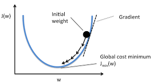

<h1>The Math of Neural Networks</h1>

**Basic overview**

The neural network generates a matrix of random values, called weights; the model multiplies the weights by an input matrix of sample data, this is the models predictions. Then the predictions are checked against the actual output values, and the weights are updated such that the next prediction will be closer to the actual values. This process is repeated x times until the weights can accurately predict an output given new inputs. If x is too large the model will be overfit to the sample data, meaning that the model is extremely accurate for the sample data, but nothing else. If x is too small, the weights will be essentially random and wont be able to predict anything accurately. A "one layer" neural network is a network with just an input and an output. Some basic matrix calculations and an immediate prediction can be shown as follows: 

There are x input neurons, or data to predict off of , and an output neuron, y. Each input neuron value is multiplied by its respective weight and combined to give a final output.

**Activation functions**

Whether its relu , sigmoid, or something else, an activation functions main purpose is to take in a matrix and output their normalized weights. This means that any number will be converted to a value between 0 and 1 with no negative numbers. Most current neural networks (not counting convolutional or recurrent neural networks) use a sigmoid activation function. 

Sigmoid functions, also known as logistic functions can be defined as f(x) = 1/1+e^-x. Sigmoid functions are important because they introduce nonlinearities into the system, and in turn allows the model to predict outputs that are nonlinear relative to their input. The graph of a sigmoid function is shown to the right. 

Notice that an input of 0 will return 0.5 and as x increases, y gets closer to 1,  but never above 1 and   as x decreases, y gets closer to 0, but never below 0. 

	

The reason that programmers chose to use a function with Euler’s number is because the derivative of Euler's number is itself. Another plus to Euler's number is that it is a constant so programmers don't need to use computationally intensive functions like square roots or logarithms. This is important because the derivative of this function for later use is much easier to compute and much less computationally intensive than most other functions that do the same thing. The derivative of the sigmoid function is described as f’(x) = x*(1-x). The graph of the derivative of a sigmoid function compared to a sigmoid function is shown here.

 Notice that the closer to 0, the larger the slope, this will be important later in how weights are updated and the model is trained.

 

**Input Layer**

The model is given a matrix x as input values and a vector y as output values.

The example on the right has 3 input neurons and 1 output neuron to train off of. This means that the model has three inputs to calculate a probability off of and gives one output. Notice that the pattern here is completely linear, the output is equal to the first value in each row. This means that a one layer neural network can make predictions based off this input easily, no hidden layers are needed. 

A matrix of random weights are then generated. The weight matrix will have 3 rows and one column, this way the dot product can computed between the input matrix and the weight matrix for predictions.

The first step in neural net calculations is to take the dot product of the input matrix and the first layers weight matrix. Feeding this through an activation function, such as a sigmoid function, and adding the probabilities of each row (if there are multiple columns, in this case there aren't) will return the overall probability that the output is a one. The activation function normalizes all probabilities and makes sure no negative probabilities are present.

**Back propagation**

The initial predictions will be essentially random as the weight matrix is initialized with random values. The model needs to change itself to become more accurate, this is where a method called back propagation comes into effect. The error between actual and predicted values is calculated, the prediction matrix is fed through the derivative of an activation function. If the model is certain that the prediction is right, the sigmoid function will return a probability closer to 0 or 1, thusly the derivative will return a lower slope (refer to the derivative graph). The derivative of the prediction function is multiplied by the error matrix and amplifies any uncertainties in the model. Lastly this matrix is subtracted from the original weight matrix, so in the next cycle the predictions are closer to the actual values. This is also called gradient descent as the matrix follows a "gradient" slope to values with the least possible error. The figure above shows a gradient descent where J(w) is the cost with weights w.  

**Output layer**

Here the model outputs its predictions and runs back propagation, this cycle is repeated x times. X needs to be chosen such that the model doesn't fit itself too closely to the sample data, but also such that it can still accurately predict given any data. The model then displays the error, current weight matrices and any other relevant data.

